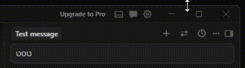
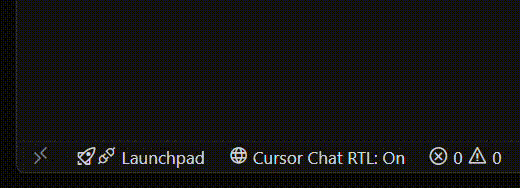

# Cursor Chat RTL Support

> **Adds Right-to-Left (RTL) text support for Hebrew, Arabic & Persian to the Cursor IDE chat.**

---

## 🌐 Languages | שפות | اللغات | زبان‌ها

| | Language | Quick Links |
|---|---|---|
| 🇺🇸 | English | [View Extension Explanation ↓](#english) |
| 🇮🇱 | עברית | [להסבר על התוסף בעברית ↓](#hebrew) |
| 🇸🇦 | عربية | [لشرح الملحق بالعربية ↓](#arabic) |
| 🇮🇷 | فارسی | [برای توضیح افزونه به فارسی ↓](#persian) |

---

### 🎬 Demo

RTL <strong>⇄</strong> Button

 

 Status Bar

[🔝 Back to top](#cursor-chat-rtl-support)

## 🇺🇸 English

A VS Code extension that adds Right-to-Left (RTL) text direction support to the **Cursor IDE** chat interface. It injects CSS/JS into the IDE, which includes backup files. Designed for Hebrew, Arabic, and Persian speakers who want natural text alignment when chatting — without affecting code blocks or UI elements.

> **Note:** This extension is for Cursor IDE only. It does not patch VS Code or other editors.

### 🤔 Why is this needed?

Cursor IDE lacks native RTL support in its chat. This often results in:

- ❌ Hebrew, Arabic, and Persian text appearing misaligned
- ❌ Difficulty reading mixed-language conversations (code + RTL text)
- ❌ Inconsistent UI behavior in the chat panel

**Cursor Chat RTL Support** fixes these issues by injecting CSS and a toggle button into Cursor's workbench — while strictly preserving LTR for code blocks and terminal outputs.

### ✨ Features

| Feature | Description |
|---|---|
| ▶️ Activate | Injects CSS and a toggle button (⇄) into the Cursor chat toolbar |
| ⏹️ Deactivate | Restores original files from backup |
| 🔍 Check Status | Shows whether RTL is currently installed |
| 📊 Status Bar | Shows current RTL state at a glance — click to toggle |
| 🔄 Auto-reactivate | Automatically restores RTL after Cursor updates |

---

### 🚀 How to Use

#### 📊 Option 1: Status Bar

After installation, a status bar item appears at the bottom of Cursor:

| Status | Meaning |
|---|---|
| `Cursor Chat RTL: On` | RTL is injected and active |
| `Cursor Chat RTL: Off` | RTL is not active |
| `Cursor Chat RTL: N/A` | Cursor IDE not found |

**Click the status bar item** to toggle RTL on or off (a confirmation will appear).

#### 🎯 Option 2: Command Palette

Press `Ctrl+Shift+P` (or `Cmd+Shift+P` on macOS) and search for:

| Command | Action |
|---|---|
| `Cursor Chat RTL: Activate` | ▶️ Enable RTL support with toggle button |
| `Cursor Chat RTL: Deactivate` | ⏹️ Disable RTL and restore original files |
| `Cursor Chat RTL: Check Status` | 🔍 View installation status |

> ⚠️ **Important:** After Activate / Deactivate, you must **fully quit Cursor** (File → Exit) and reopen it. Developer: Reload Window is often not enough because the workbench files are loaded from disk at startup.

#### 💬 Using RTL in Chat

After activating and restarting Cursor:

1. Open the chat panel (Agent mode)
2. Click the **⇄** button in the chat toolbar (next to the + New Chat button)
3. The chat interface switches to RTL — text aligns to the right
4. Click again to return to LTR

The toggle state is saved in `localStorage` and persists across sessions. It applies globally to all chat tabs.

> 💡 **Tip:** Not every conversation needs RTL — you can toggle it per session. Use ⇄ only in conversations where you write in Hebrew, Arabic, or Persian.

> 🔄 **Auto-reactivate:** If Cursor updates and replaces its workbench files, RTL is automatically re-injected on the next startup.

---

### ↔️ What Changes in RTL Mode?

| ✅ Becomes RTL | 🔒 Stays LTR |
|---|---|
| User messages | Code blocks |
| Claude's text responses | Tool calls and results |
| Lists and paragraphs | Thinking blocks |
| Tables (text alignment) | Terminals and diffs |
| | Buttons and UI elements |
| | Checkpoints |

---

### 🔧 Troubleshooting

<strong>❓ Extension doesn't find Cursor IDE</strong>

- The extension looks for Cursor in standard install locations
- **Windows:** `%LOCALAPPDATA%\Programs\cursor`, `Program Files`
- **macOS:** `/Applications/Cursor.app`
- **Linux:** `/opt/Cursor`, `/usr/share/cursor`
- Use `Cursor Chat RTL: Check Status` to see what was found

<strong>❓ Changes not visible after activating</strong>

- Make sure to **fully quit Cursor** (File → Exit) and reopen it
- Developer: Reload Window often does **not** reload the workbench from disk
- Check the Output panel → "Cursor Chat RTL" for error messages

<strong>❓ RTL stopped working after a Cursor update</strong>

- When Cursor updates, it replaces its workbench files and removes the RTL injection
- The extension **automatically re-injects** RTL on the next startup
- If it doesn't restore automatically, run **Cursor Chat RTL: Activate** manually

<strong>❓ Permission Denied error</strong>

- **Windows:** Try running Cursor as Administrator
- **macOS / Linux:** Check file permissions on Cursor's installation directory

<strong>❓ The ⇄ button doesn't appear</strong>

- Make sure the chat panel is open in **Agent mode**
- The button is placed in the toolbar next to the + New Chat button
- Try fully quitting and reopening Cursor

---

### 📄 License

MIT — see [LICENSE](LICENSE) for details.

[🔝 Back to top](#cursor-chat-rtl-support)

---

[🔝 חזרה למעלה](#cursor-chat-rtl-support)

## 🇮🇱 עברית

תוסף שמוסיף תמיכת כיווניות מימין לשמאל (RTL) לממשק הצ'אט של **Cursor IDE**. התוסף מוסיף CSS/JS ל-IDE וזה כולל קבצי גיבוי. מיועד לדוברי עברית, ערבית ופרסית שרוצים יישור טקסט טבעי בשיחה — מבלי לפגוע בבלוקי קוד או ברכיבי הממשק.

> **הערה:** התוסף הזה מיועד ל-Cursor IDE בלבד. הוא לא משנה את VS Code או עורכים אחרים.

### 🤔 למה זה נחוץ?

ב-Cursor IDE אין תמיכת RTL מובנית בצ'אט. הדבר גורם ל:

- ❌ טקסט עברי, ערבי ופרסי שמוצג בצורה לא מיושרת
- ❌ קושי בקריאת שיחות בשפות מעורבות (קוד + טקסט RTL)
- ❌ התנהגות ממשק לא עקבית בפאנל הצ'אט

התוסף **Cursor Chat RTL Support** פותר בעיות אלה על ידי הזרקת CSS וכפתור מתג לתוך ה-workbench של Cursor — תוך שמירה על LTR עבור בלוקי קוד ופלטי טרמינל.

### ✨ תכונות

| תכונה | תיאור |
|---|---|
| ▶️ הפעלה | מזריק CSS וכפתור מתג (⇄) לסרגל הכלים של הצ'אט |
| ⏹️ כיבוי | משחזר קבצים מקוריים מגיבוי |
| 🔍 בדיקת סטטוס | מציג האם RTL מותקן כרגע |
| 📊 שורת מצב | מציג את המצב הנוכחי בתחתית המסך — לחץ להחלפה |
| 🔄 הפעלה מחדש אוטומטית | משחזר RTL אוטומטית לאחר עדכוני Cursor |

---

### 🚀 איך להשתמש

#### 📊 אפשרות 1: שורת המצב

לאחר ההתקנה, מופיע פריט בשורת המצב בתחתית Cursor:

| סטטוס | משמעות |
|---|---|
| `Cursor Chat RTL: On` | RTL מופעל ופעיל |
| `Cursor Chat RTL: Off` | RTL לא פעיל |
| `Cursor Chat RTL: N/A` | Cursor IDE לא נמצא |

**לחץ על פריט שורת המצב** כדי להחליף בין הפעלה וכיבוי (תופיע שאלת אישור).

#### 🎯 אפשרות 2: לוח פקודות

לחץ `Ctrl+Shift+P` (מק: `Cmd+Shift+P`) וחפש:

| פקודה | פעולה |
|---|---|
| `Cursor Chat RTL: Activate` | ▶️ הפעלת תמיכת RTL עם כפתור מתג |
| `Cursor Chat RTL: Deactivate` | ⏹️ כיבוי ושחזור קבצים מקוריים |
| `Cursor Chat RTL: Check Status` | 🔍 הצגת מצב ההתקנה |

> ⚠️ **חשוב:** לאחר הפעלה / כיבוי, יש **לסגור את Cursor לחלוטין** (File → Exit) ולפתוח מחדש. Developer: Reload Window לרוב לא מספיק כי קבצי ה-workbench נטענים מהדיסק בעליית התוכנה.

#### 💬 שימוש בצ'אט

לאחר הפעלה ואתחול מחדש של Cursor:

1. פתח את פאנל הצ'אט (מצב Agent)
2. לחץ על כפתור **⇄** בסרגל הכלים של הצ'אט (ליד כפתור + צ'אט חדש)
3. הממשק עובר לכיווניות מימין לשמאל — טקסט יישר לימין
4. לחץ שוב כדי לחזור ל-LTR

מצב הכפתור נשמר ב-localStorage ונשמר בין הפעלות. הוא חל על כל כרטיסיות הצ'אט גלובלית.

> 💡 **טיפ:** לא כל שיחה צריכה RTL — ניתן להחליף לכל session. לחץ ⇄ רק בשיחות שבהן אתה כותב בעברית, ערבית או פרסית.

> 🔄 **הפעלה מחדש אוטומטית:** אם Cursor מתעדכן ומחליף את קבצי ה-workbench, RTL משוחזר אוטומטית בהפעלה הבאה.

---

### ↔️ מה משתנה במצב RTL?

| ✅ הופך לכיווניות מימין לשמאל | 🔒 נשאר בכיווניות רגילה |
|---|---|
| הודעות המשתמש | בלוקי קוד |
| תשובות טקסט של Claude | כלים ותוצאותיהם |
| רשימות ופסקאות | בלוק חשיבה |
| טבלאות (יישור טקסט) | טרמינלים ו-diffs |
| | כפתורים וממשק |
| | Checkpoints |

---

### 🔧 פתרון בעיות

<strong>❓ התוסף לא מוצא את Cursor IDE</strong>

- התוסף מחפש Cursor בנתיבי התקנה סטנדרטיים
- **Windows:** ‏`%LOCALAPPDATA%\Programs\cursor`, ‏`Program Files`
- **macOS:** ‏`/Applications/Cursor.app`
- **Linux:** ‏`/opt/Cursor`, ‏`/usr/share/cursor`
- השתמש ב-`Cursor Chat RTL: Check Status` כדי לראות מה נמצא

<strong>❓ השינויים לא נראים לאחר ההפעלה</strong>

- ודא שאתה **סוגר את Cursor לחלוטין** (File → Exit) ופותח מחדש
- Developer: Reload Window לרוב **לא** טוען מחדש את ה-workbench מהדיסק
- בדוק את פאנל הOutput ← "Cursor Chat RTL" להודעות שגיאה

<strong>❓ ה-RTL הפסיק לעבוד לאחר עדכון Cursor</strong>

- כש-Cursor מתעדכן, הוא מחליף את קבצי ה-workbench ומסיר את ההזרקה
- התוסף **משחזר אוטומטית** את ה-RTL בהפעלה הבאה
- אם זה לא משוחזר אוטומטית, הפעל ידנית את **Cursor Chat RTL: Activate**

<strong>❓ שגיאת הרשאות</strong>

- **Windows:** נסה להריץ את Cursor כמנהל מערכת
- **macOS / Linux:** בדוק הרשאות קבצים בתיקיית ההתקנה של Cursor

<strong>❓ כפתור ⇄ לא מופיע</strong>

- ודא שפאנל הצ'אט פתוח במצב **Agent**
- הכפתור ממוקם בסרגל הכלים ליד כפתור + צ'אט חדש
- נסה לסגור ולפתוח מחדש את Cursor לחלוטין

---

### 📄 רישיון

MIT — ראה קובץ [LICENSE](LICENSE) לפרטים.

[🔝 חזרה למעלה](#cursor-chat-rtl-support)

---

[🔝 العودة إلى الأعلى](#cursor-chat-rtl-support)

## 🇸🇦 عربية

إضافة تضيف دعم اتجاه النص من اليمين إلى اليسار (RTL) لواجهة المحادثة في **Cursor IDE**. تقوم بحقن CSS/JS في الـ IDE، وهذا يشمل ملفات النسخ الاحتياطي. مصممة لمتحدثي العربية والعبرية والفارسية الذين يريدون محاذاة طبيعية للنص — دون التأثير على كتل الكود أو عناصر الواجهة.

> **ملاحظة:** هذه الإضافة مخصصة لـ Cursor IDE فقط. لا تقوم بتعديل VS Code أو محررات أخرى.

### 🤔 لماذا هذا مطلوب؟

Cursor IDE يفتقر إلى دعم RTL المدمج في المحادثة. وهذا يؤدي إلى:

- ❌ ظهور النصوص العربية والعبرية والفارسية بمحاذاة غير صحيحة
- ❌ صعوبة قراءة المحادثات متعددة اللغات (كود + نص RTL)
- ❌ سلوك غير متسق لواجهة المستخدم في لوحة المحادثة

الإضافة **Cursor Chat RTL Support** تحل هذه المشكلات عن طريق حقن CSS وزر تبديل في workbench الخاص بـ Cursor — مع الحفاظ على LTR لكتل الكود ومخرجات الطرفية.

### ✨ الميزات

| الميزة | الوصف |
|---|---|
| ▶️ تفعيل | تحقن CSS وزر تبديل (⇄) في شريط أدوات المحادثة |
| ⏹️ إيقاف | تستعيد الملفات الأصلية من النسخ الاحتياطية |
| 🔍 فحص الحالة | يعرض ما إذا كان RTL مثبتًا حاليًا |
| 📊 شريط الحالة | يعرض الحالة الحالية — انقر للتبديل |
| 🔄 إعادة تفعيل تلقائية | تستعيد RTL تلقائيًا بعد تحديثات Cursor |

---

### 🚀 طريقة الاستخدام

#### 📊 الخيار 1: شريط الحالة

بعد التثبيت، يظهر عنصر في شريط الحالة في أسفل Cursor:

| الحالة | المعنى |
|---|---|
| `Cursor Chat RTL: On` | RTL مفعّل ونشط |
| `Cursor Chat RTL: Off` | RTL غير نشط |
| `Cursor Chat RTL: N/A` | Cursor IDE غير موجود |

**انقر على عنصر شريط الحالة** للتبديل بين التفعيل والإيقاف (ستظهر رسالة تأكيد).

#### 🎯 الخيار 2: لوحة الأوامر

اضغط `Ctrl+Shift+P` (ماك: `Cmd+Shift+P`) وابحث عن:

| الأمر | الإجراء |
|---|---|
| `Cursor Chat RTL: Activate` | ▶️ تفعيل دعم RTL مع زر تبديل |
| `Cursor Chat RTL: Deactivate` | ⏹️ إيقاف الدعم واستعادة الملفات الأصلية |
| `Cursor Chat RTL: Check Status` | 🔍 عرض حالة التثبيت |

> ⚠️ **مهم:** بعد التفعيل / الإيقاف، يجب **إغلاق Cursor بالكامل** (File → Exit) وإعادة فتحه. Developer: Reload Window غالبًا لا يكفي لأن ملفات workbench تُحمّل من القرص عند بدء التشغيل.

#### 💬 الاستخدام في المحادثة

بعد التفعيل وإعادة تشغيل Cursor:

1. افتح لوحة المحادثة (وضع Agent)
2. اضغط على زر **⇄** في شريط أدوات المحادثة (بجانب زر + محادثة جديدة)
3. تتحول الواجهة إلى RTL — يُحاذى النص إلى اليمين
4. اضغط مرة أخرى للعودة إلى LTR

حالة الزر تُحفظ في localStorage وتستمر بين الجلسات. ينطبق بشكل عام على جميع علامات تبويب المحادثة.

> 💡 **نصيحة:** ليست كل المحادثات تحتاج RTL — يمكنك التبديل لكل جلسة. استخدم ⇄ فقط في المحادثات التي تكتب فيها بالعربية أو العبرية أو الفارسية.

> 🔄 **إعادة تفعيل تلقائية:** إذا تم تحديث Cursor واستبدال ملفات workbench، يتم استعادة RTL تلقائيًا عند بدء التشغيل التالي.

---

### ↔️ ماذا يتغير في وضع RTL؟

| ✅ يتحول إلى RTL | 🔒 يبقى LTR |
|---|---|
| رسائل المستخدم | كتل الكود |
| ردود نص Claude | الأدوات ونتائجها |
| القوائم والفقرات | كتلة التفكير |
| الجداول (محاذاة النص) | الطرفيات والفروقات |
| | الأزرار والواجهة |
| | نقاط التحقق |

---

### 🔧 حل المشاكل

<strong>❓ الإضافة لا تجد Cursor IDE</strong>

- الإضافة تبحث عن Cursor في مسارات التثبيت القياسية
- **Windows:** `%LOCALAPPDATA%\Programs\cursor`، `Program Files`
- **macOS:** `/Applications/Cursor.app`
- **Linux:** `/opt/Cursor`، `/usr/share/cursor`
- استخدم `Cursor Chat RTL: Check Status` لرؤية ما تم العثور عليه

<strong>❓ التغييرات لا تظهر بعد التفعيل</strong>

- تأكد من **إغلاق Cursor بالكامل** (File → Exit) وإعادة فتحه
- Developer: Reload Window غالبًا **لا** يعيد تحميل workbench من القرص
- تحقق من لوحة Output ← "Cursor Chat RTL" لرسائل الخطأ

<strong>❓ توقف RTL عن العمل بعد تحديث Cursor</strong>

- عند تحديث Cursor، يتم استبدال ملفات workbench وإزالة حقن RTL
- الإضافة **تستعيد تلقائيًا** RTL عند بدء التشغيل التالي
- إذا لم تتم الاستعادة تلقائيًا، شغّل **Cursor Chat RTL: Activate** يدويًا

<strong>❓ خطأ في الصلاحيات</strong>

- **Windows:** جرّب تشغيل Cursor كمسؤول
- **macOS / Linux:** تحقق من صلاحيات الملفات في مجلد تثبيت Cursor

<strong>❓ زر ⇄ لا يظهر</strong>

- تأكد أن لوحة المحادثة مفتوحة في وضع **Agent**
- الزر موجود في شريط الأدوات بجانب زر + محادثة جديدة
- جرّب إغلاق Cursor بالكامل وإعادة فتحه

---

### 📄 الترخيص

MIT — انظر ملف [LICENSE](LICENSE) للتفاصيل.

[🔝 العودة إلى الأعلى](#cursor-chat-rtl-support)

---

[🔝 بازگشت به بالا](#cursor-chat-rtl-support)

## 🇮🇷 فارسی

یک افزونه که پشتیبانی از جهت متن راست به چپ (RTL) را به رابط چت **Cursor IDE** اضافه می‌کند. این افزونه CSS/JS را به IDE تزریق می‌کند، که شامل فایل‌های پشتیبان نیز می‌شود. طراحی شده برای فارسی‌زبانان، عربی‌زبانان و عبری‌زبانان که می‌خواهند تراز متن طبیعی هنگام چت داشته باشند — بدون تأثیر بر بلوک‌های کد یا عناصر رابط کاربری.

> **توجه:** این افزونه فقط برای Cursor IDE است. VS Code یا ویرایشگرهای دیگر را تغییر نمی‌دهد.

### 🤔 چرا این مورد نیاز است؟

Cursor IDE فاقد پشتیبانی بومی RTL در چت است. این اغلب منجر به موارد زیر می‌شود:

- ❌ نمایش نامرتب متن فارسی، عربی و عبری
- ❌ دشواری در خواندن مکالمات چندزبانه (کد + متن RTL)
- ❌ رفتار ناسازگار رابط کاربری در پنل چت

افزونه **Cursor Chat RTL Support** این مشکلات را با تزریق CSS و دکمه تغییر به workbench ‏Cursor حل می‌کند — در حالی که LTR را برای بلوک‌های کد و خروجی‌های ترمینال حفظ می‌کند.

### ✨ ویژگی‌ها

| ویژگی | توضیح |
|---|---|
| ▶️ فعال‌سازی | CSS و دکمه تغییر (⇄) را در نوار ابزار چت تزریق می‌کند |
| ⏹️ غیرفعال‌سازی | فایل‌های اصلی را از نسخه پشتیبان بازیابی می‌کند |
| 🔍 بررسی وضعیت | نشان می‌دهد آیا RTL در حال حاضر نصب است |
| 📊 نوار وضعیت | وضعیت فعلی را نمایش می‌دهد — برای تغییر کلیک کنید |
| 🔄 فعال‌سازی مجدد خودکار | RTL را پس از به‌روزرسانی‌های Cursor به‌طور خودکار بازیابی می‌کند |

---

### 🚀 نحوه استفاده

#### 📊 گزینه ۱: نوار وضعیت

پس از نصب، یک آیتم در نوار وضعیت پایین Cursor نمایش داده می‌شود:

| وضعیت | معنی |
|---|---|
| `Cursor Chat RTL: On` | RTL فعال و نشط |
| `Cursor Chat RTL: Off` | RTL غیرفعال |
| `Cursor Chat RTL: N/A` | Cursor IDE پیدا نشد |

**روی آیتم نوار وضعیت کلیک کنید** تا بین فعال و غیرفعال تغییر دهید (پیام تأیید نمایش داده می‌شود).

#### 🎯 گزینه ۲: پالت فرمان

`Ctrl+Shift+P` (مک: `Cmd+Shift+P`) را فشار دهید و جستجو کنید:

| فرمان | عملکرد |
|---|---|
| `Cursor Chat RTL: Activate` | ▶️ فعال‌سازی پشتیبانی RTL با دکمه تغییر |
| `Cursor Chat RTL: Deactivate` | ⏹️ غیرفعال‌سازی و بازیابی فایل‌های اصلی |
| `Cursor Chat RTL: Check Status` | 🔍 نمایش وضعیت نصب |

> ⚠️ **مهم:** پس از فعال‌سازی / غیرفعال‌سازی، باید **Cursor را کاملاً ببندید** (File → Exit) و دوباره باز کنید. Developer: Reload Window اغلب کافی نیست زیرا فایل‌های workbench هنگام راه‌اندازی از دیسک بارگذاری می‌شوند.

#### 💬 استفاده در چت

پس از فعال‌سازی و راه‌اندازی مجدد Cursor:

1. پانل چت را باز کنید (حالت Agent)
2. روی دکمه **⇄** در نوار ابزار چت کلیک کنید (کنار دکمه + چت جدید)
3. رابط به RTL تغییر می‌کند — متن به سمت راست تراز می‌شود
4. دوباره کلیک کنید تا به LTR بازگردید

وضعیت دکمه در localStorage ذخیره می‌شود و بین جلسات باقی می‌ماند. به‌صورت عمومی بر همه زبانه‌های چت اعمال می‌شود.

> 💡 **نکته:** همه مکالمات نیاز به RTL ندارند — می‌توانید آن را برای هر جلسه تغییر دهید. از ⇄ فقط در مکالماتی استفاده کنید که به فارسی، عربی یا عبری می‌نویسید.

> 🔄 **فعال‌سازی مجدد خودکار:** اگر Cursor به‌روزرسانی شد و فایل‌های workbench جایگزین شدند، RTL به‌طور خودکار در راه‌اندازی بعدی بازیابی می‌شود.

---

### ↔️ چه چیزی در حالت RTL تغییر می‌کند؟

| ✅ تبدیل به RTL | 🔒 باقی می‌ماند LTR |
|---|---|
| پیام‌های کاربر | بلوک‌های کد |
| پاسخ‌های متنی Claude | فراخوانی‌های ابزار و نتایج |
| لیست‌ها و پاراگراف‌ها | بلوک‌های تفکر |
| جداول (تراز متن) | ترمینال‌ها و تفاوت‌ها |
| | دکمه‌ها و عناصر رابط کاربری |
| | نقاط بازیابی |

---

### 🔧 عیب‌یابی

<strong>❓ افزونه Cursor IDE را پیدا نمی‌کند</strong>

- افزونه Cursor را در مسیرهای استاندارد نصب جستجو می‌کند
- **Windows:** `%LOCALAPPDATA%\Programs\cursor`، `Program Files`
- **macOS:** `/Applications/Cursor.app`
- **Linux:** `/opt/Cursor`، `/usr/share/cursor`
- از `Cursor Chat RTL: Check Status` برای مشاهده نتایج استفاده کنید

<strong>❓ تغییرات پس از فعال‌سازی نمایان نیستند</strong>

- مطمئن شوید که **Cursor را کاملاً بسته‌اید** (File → Exit) و دوباره باز کنید
- Developer: Reload Window اغلب workbench را **از دیسک مجدداً بارگذاری نمی‌کند**
- لوحه Output ← "Cursor Chat RTL" را برای پیام‌های خطا بررسی کنید

<strong>❓ RTL پس از به‌روزرسانی Cursor کار نمی‌کند</strong>

- هنگامی که Cursor به‌روزرسانی می‌شود، فایل‌های workbench جایگزین شده و حقن RTL حذف می‌شود
- افزونه **به‌طور خودکار** RTL را در راه‌اندازی بعدی بازیابی می‌کند
- اگر به‌طور خودکار بازیابی نشد، دستور **Cursor Chat RTL: Activate** را دستی اجرا کنید

<strong>❓ خطای مجوز</strong>

- **Windows:** Cursor را به عنوان Administrator اجرا کنید
- **macOS / Linux:** مجوزهای فایل در پوشه نصب Cursor را بررسی کنید

<strong>❓ دکمه ⇄ نمایش داده نمی‌شود</strong>

- مطمئن شوید پنل چت در حالت **Agent** باز است
- دکمه در نوار ابزار کنار دکمه + چت جدید قرار دارد
- Cursor را کاملاً ببندید و دوباره باز کنید

---

### 📄 مجوز

MIT — برای جزئیات فایل [LICENSE](LICENSE) را ببینید.

[🔝 بازگشت به بالا](#cursor-chat-rtl-support)

